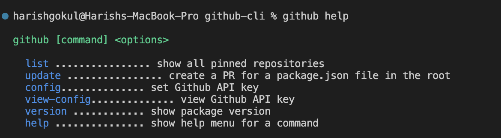
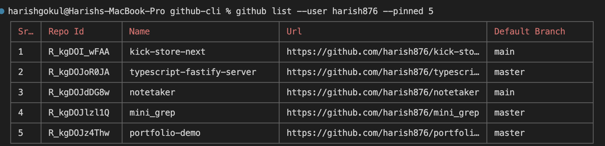

# Github CLI in Node.js

A Github CLI app in Node.js. The app checks weather in command line.

## Usages

```sh
github
github config -k={github_api_key}
github view-config
github list
github update
```

## Screenshots

### `main menu`



### `github list`



## How to build locally

```sh
npm i
npm link
```

## License

Feel free to use the code in this repository as it is under MIT license.